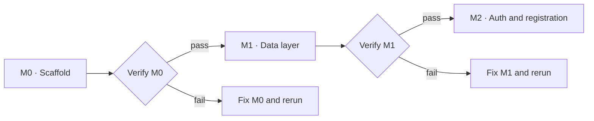

# Milestone verification gate

No milestone becomes active until the previous milestone has a passing verifier report.



The verifier checks required artifacts, configuration invariants, automated quality gates, dependency safety, and a production HTTP smoke test. It stops at the first failed boundary and writes its detailed evidence to the ignored `.verification/` directory.

## Commands

```sh
npm run verify:m0
npm run verify:milestone -- M0
```

Each later milestone adds its own suite before that milestone can be marked complete. The status record below is updated only after the corresponding suite passes.

| Milestone | Gate status | Next milestone |
|---|---|---|
| M0 · Setup and scaffold | Pending verifier run | M1 locked |
| M1 · Data layer | Not started | M2 locked |
