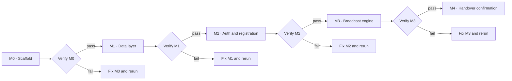

# Milestone verification gate

No milestone becomes active until the previous milestone has a passing verifier report.



The verifier checks required artifacts, configuration invariants, automated quality gates, dependency safety, and a production HTTP smoke test. It stops at the first failed boundary and writes its detailed evidence to the ignored `.verification/` directory.

## Commands

```sh
npm run verify:m0
npm run verify:m1
npm run verify:m2
npm run verify:m3
npm run verify:milestone -- M3
```

Each later milestone adds its own suite before that milestone can be marked complete. The status record below is updated only after the corresponding suite passes.

| Milestone | Gate status | Next milestone |
|---|---|---|
| M0 · Setup and scaffold | Passed · 2026-08-18 · `2f23921` | M1 unlocked |
| M1 · Data layer | Passed · 2026-08-18 · `5f22ad5` | M2 unlocked |
| M2 · Auth and registration | Passed · 2026-08-19 · `24de594` | M3 unlocked |
| M3 · Broadcast engine | Passed · 2026-08-19 · `d2c49d1` | M4 unlocked |
| M4 · Handover confirmation | Not started | M5 locked |
