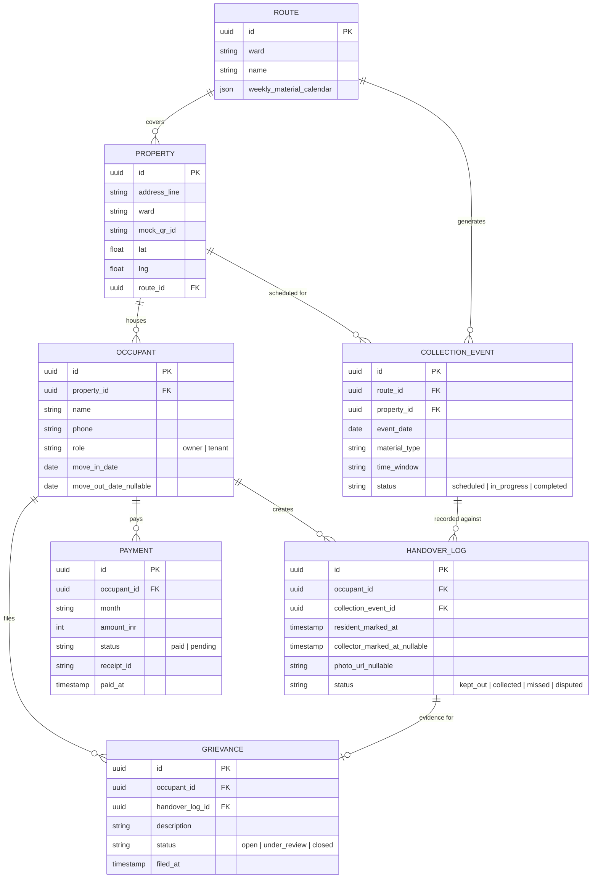
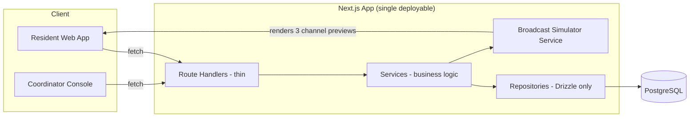

# Vandi — Technical & Build Spec

**Companion to `vandi-idea-doc.docx`.** This is the engineering brief — hand this directly to Codex as your build prompt, or work through it milestone by milestone.

Build window: **Aug 18 → Aug 27, 2026** (10 calendar days, one weekend: Aug 22–23).
**Build tool: Codex, exclusively, from the first commit.** This document itself was planned and written with Claude — that's fine, it's a planning artifact, not the submission. The repository you actually submit is a different thing: every line of the app, from scaffold to final deploy, should be produced through Codex, because that's what the hackathon rules require and what your write-up has to demonstrate.

---

## 0. Hard constraints, read first

From the hackathon rules — violating these risks disqualification, not just a lower score:

- **Codex builds the submitted prototype, full stop.** Not "Codex was involved somewhere" — start the project inside Codex on Day 1 (§9), keep it there through the final deploy, and keep a record (commit history is enough) of what Codex produced at each milestone, because the write-up has to explain its contribution concretely.
- **No live government systems, no real APIs, no scraping.** Everything about Haritha Mithram, HKS routes, and Kochi households in your demo is synthetic. You may *reference* how the real system works — you've already researched it — but the build must not attempt to connect to it.
- **No real personal data.** No real phone numbers tied to real people, no real Aadhaar/PAN, no real payment credentials, no real health information.
- **Every feature you demo must actually work.** Don't build a screen that looks right but has no logic behind it if you plan to show it live.
- **Label it clearly as an independent hackathon prototype.** Don't use "Haritha Mithram," Kerala government logos, or LSGD branding in a way that implies partnership or endorsement.

---

## 1. Scope: what's in, what's out

**In scope (build this):**

1. Resident registration as an *individual*, linked to a property (not the property itself being the account).
2. Daily broadcast of collection type + time window, previewed across three channels (app, SMS-style, WhatsApp-style).
3. Resident-side handover confirmation ("kept out") and collector-side confirmation ("collected") producing one timestamped, authorization-checked record.
4. Per-resident payment ledger with mock UPI payment and downloadable/viewable receipt history.
5. A resident's full history view (schedule adherence + payments) — the "proof pack" that answers the original problem.

**Out of scope for the hackathon (explicitly mock or defer — say so in your write-up, don't hide it):**

- Real SMS/WhatsApp delivery (Twilio, WhatsApp Business API) — simulate the message content and channel, don't actually send anything.
- Real UPI/payment gateway integration — a fake "Pay ₹80" button that instantly succeeds and logs a receipt is enough.
- Real OTP/SMS-based auth — use a fixed dev OTP (e.g. `123456`) shown on-screen in a banner labeled "DEV MODE."
- Route optimization, live GPS tracking of collection vehicles, ML-based anything — not needed to prove the core idea.
- Grievance/dispute *resolution* workflow — filing a grievance can exist as a button that logs a ticket; full resolution workflow is a "roadmap" bullet, not a build target.
- Multi-tenant admin/superadmin tooling for LSGD-level oversight — mention it in the write-up as the obvious next layer, don't build it.

---

## 2. Primary persona and main journey

**Persona: Anjali, a tenant sharing a 2BHK in a non-gated building in Kochi.** She's not the property owner (Ravi is). She's currently invisible to the owner's WhatsApp group and to any official household record.

**Main journey (build this end-to-end, polish it, demo it):**

1. Anjali signs up with her phone number and self-registers against her building's address (mocked address list/QR ID — see §7 mock data). The system shows her: *"You're joining [address] — 2 other residents already registered here."*
2. The next morning, she gets a notification: **"Today: Plastic & dry waste · 7:30–9:00 AM."** Shown simultaneously in the broadcast simulator as an app push, an SMS-style bubble, and a WhatsApp-style bubble.
3. She marks **"Kept out"** with a timestamp (optional photo upload, stored as-is, no processing needed).
4. On the coordinator/collector side (a second, simpler screen), the pickup gets marked **"Collected"** with its own timestamp.
5. Anjali opens **History** and sees a clean, chronological log: date, material, her "kept out" timestamp, the "collected" timestamp, and her payment history with digital receipts. This is the artifact that, had it existed, would have made a wrongful fine indefensible.

That's the whole demo. Three minutes is enough if this journey is smooth.

---

## 3. Secondary journeys (only if the primary is done, tested, and polished with time left)

In priority order:

1. **Coordinator/HKS-supervisor view** — set tomorrow's material + time window for a route, see who's registered on that route, see live "kept out" counts.
2. **Grievance filing** — a button on a history entry ("Dispute this") that logs a ticket with the relevant handover record auto-attached.
3. **Shared-flat billing split** — each occupant pays their own pro-rata share instead of one person carrying the whole household's fee.

---

## 4. Data model



Notes:

- `PROPERTY.mock_qr_id` is a fictional analogue of the real Haritha Mithram QR ID — format it plausibly (e.g. `HM-EKM-04-1183`) but never claim it's real.
- `OCCUPANT.role` and the move-in/move-out dates are the entire structural fix in one field — make sure the UI surfaces this (e.g. "Ravi (owner, since 2019)" vs "Anjali (tenant, since Jun 2026)").
- Keep `HANDOVER_LOG` two-sided by design — that gap or overlap between the two timestamps *is* the evidence artifact the pitch is built around.

---

## 5. Architecture



**Stack — optimized for what one person can ship well-tested in 9 days with Codex, not for architectural purity:**

- **Next.js (App Router)**, single project, Route Handlers as the API layer. One deployable, one Vercel URL — don't stand up a separate backend service just because it's what OIA uses; a second deployable is a second thing that can break on submission day.
- **TypeScript, strict mode** throughout (§8).
- **Drizzle ORM + PostgreSQL** (Neon or Supabase free tier) — typed schema straight from §4, fast to seed and migrate.
- **Tailwind CSS**, tokens centralized (§8) — this is a civic utility app for people on slow connections and older phones; optimize for legible and trustworthy, not decorative.
- **Vitest + React Testing Library** for unit and component tests (§8).
- **Auth**: phone number + fixed dev OTP, httpOnly/secure session cookie. Not a real auth provider — not the point of the demo, and real setup time you don't have.
- **Hosting**: Vercel for the live demo link.
- **Broadcast simulator**: no external service — a component that takes a message string and renders it three ways (app push, SMS thread, WhatsApp bubble), side by side.

The three layers in the diagram — route handlers, services, repositories — are a deliberate Single Responsibility split, not decoration. See §8 for exactly how to enforce it.

---

## 6. Screen list (resident app)

1. **Sign up** — phone number, OTP (dev mode), name.
2. **Join a property** — pick from a mocked address/ward list (or scan a mocked QR — a static image is fine), see existing occupants at that address, set role (owner/tenant) and move-in date.
3. **Home / Today** — today's material + time window, big and unambiguous, "Kept out" button, broadcast-channel preview toggle (app/SMS/WhatsApp).
4. **History** — chronological handover log + payment log, filterable by month, exportable/printable view (the "proof pack").
5. **Payments** — current month's status, mock "Pay ₹__" button, receipt list.
6. **(Secondary) Coordinator console** — pick a route, set tomorrow's material + window, see registered occupants and live "kept out" counts.

---

## 7. Mock data plan

- **3–4 wards** in Kochi (real, public ward names — this is public geography, not personal/government data — e.g. Elamkulam, Kadavanthra, Panampilly Nagar, Thevara), each with a **route** and a simple weekly material calendar (Mon/Thu plastic, Wed food waste, Sat glass/metal — invented but realistic).
- **8–10 mock properties** across those wards, each with 1–4 occupants (mix of solo owners, owner+tenant, and shared flats with 3 tenants) — include the exact scenario from your own story: a shared flat where the owner isn't present day-to-day.
- **2–3 weeks of backdated collection events and handover logs**, including at least one deliberately "off" record (resident marked "kept out," collector's mark is missing or late) — this is what you'll point to on stage as the exact gap that causes wrongful fines.
- **A few months of payment history per occupant**, mixed paid/pending, so the ledger view feels real rather than empty.

Have Codex generate a `seed.ts` from the Drizzle schema — don't hand-enter this through the UI.

---

## 8. Engineering standards

These aren't box-ticking — they're what makes a 9-day solo build (a) not collapse under its own weight by day 6, and (b) hold up if a judge asks "walk me through how this works" instead of just watching the video.

### 8.1 Single Responsibility — folder structure

```
/src
  /app            → Next.js routes (App Router). Thin. No business logic, no direct DB calls.
  /components     → Presentational UI only. No data fetching inside components — pass data in as props.
  /services       → One file per domain concern (occupant.service.ts, broadcast.service.ts,
                     handover.service.ts, payment.service.ts). All business logic lives here.
  /repositories   → One file per entity (property.repo.ts, occupant.repo.ts, ...). Only Drizzle
                     queries. No business logic — a repository never decides *whether* an action
                     is allowed, only *how* to read/write it.
  /schemas        → zod validation schemas, one per entity/input shape.
  /lib            → Cross-cutting utilities: session/auth helpers, rate-limit stub, formatting.
  /db             → Drizzle schema, migrations, seed script.
/tests
  /unit           → Mirrors /src — one test file per service/repository at minimum.
```

**The rule Codex should be told explicitly, not left to infer:** a route handler calls a service; a service calls a repository; a repository touches the database. No layer skips another. Left unguided, coding agents tend to put DB queries directly in route handlers because it's faster to generate — call this out in your Codex prompts up front, it's cheaper to prevent than to refactor on day 7.

### 8.2 TypeScript

- `strict: true` and `noUncheckedIndexedAccess: true` in `tsconfig.json`.
- No `any`. If Codex reaches for `any`, that's a signal to define a proper type or zod schema instead of accepting it.
- Derive domain types from the Drizzle schema (`InferSelectModel` / `InferInsertModel`) so the type and the table can never quietly drift apart.

### 8.3 Testing

- **Vitest** for services and repositories, **React Testing Library** for components (especially the broadcast simulator and the forms).
- Standard, not a vanity metric: **every service and repository function ships with at least one unit test before you move to the next milestone.** Not 100% coverage — no untested service.
- **Prioritize authorization tests over incidental coverage.** The one test that matters most: *can Anjali mark a handover for Ravi's property?* It should fail. Given the whole pitch is "a trustworthy record of who did what," a bug here undermines the actual point of the product, not just a feature.

### 8.4 Tailwind

- Centralize design tokens (colors, spacing, radii) in `tailwind.config.ts` — don't scatter arbitrary values (`bg-[#123456]`) through components.
- Build a small set of reusable primitives (`Button`, `Card`, `Badge`, `StatusPill`) rather than repeating className strings per screen — the same Single Responsibility idea applied to UI: presentation logic lives once.

### 8.5 Security checklist (concrete — check these off before each milestone's "done")

- [ ] Every API route validates its input with a zod schema before touching the database.
- [ ] Drizzle's parameterized queries only — never raw, string-interpolated SQL.
- [ ] Session cookie set `httpOnly`, `secure`, `sameSite: lax`.
- [ ] Every mutation checks that the acting occupant actually owns/has rights to the resource being changed — authorization, not just "are you logged in."
- [ ] The dev OTP path is clearly banner-labeled "DEV MODE" and can't be mistaken for real auth in the demo.
- [ ] `.env.example` committed, `.env` gitignored, no secrets or keys anywhere in repo history.
- [ ] `npm audit` run before each deploy; high/critical findings resolved or explicitly noted in the write-up.
- [ ] A rate-limit stub (even a simple in-memory counter) on the OTP/login endpoint — signals awareness even though real abuse-prevention is out of scope.
- [ ] No PII beyond what the demo needs; synthetic phone numbers clearly outside real Indian number ranges.

---

## 9. Codex-only build workflow

Since the write-up has to explain Codex's contribution concretely, plan attributable, milestone-sized prompts rather than one giant "build the whole app" request:

1. **Scaffold** — Next.js + TypeScript (strict) + Tailwind + Drizzle + Vitest project structure, built from §5 and §8.1's folder layout. Get `npm run lint && npm run test && npm run build` green on the empty scaffold before writing a single feature.
2. **Schema + migrations** — feed Codex the entities in §4 directly (the mermaid block is already close to a spec it can turn into a Drizzle schema); generate the seed script from §7 in the same pass.
3. **Repository layer** — one prompt per entity, explicitly constrained to "Drizzle queries only, no business logic" (§8.1).
4. **Service layer** — one prompt per domain concern, each with its unit tests requested in the same prompt, not as an afterthought.
5. **API routes** — thin route handlers calling services, each with a zod input schema.
6. **UI screens** — one prompt per screen in §6, with the exact copy from §2's journey so the demo narration matches the UI text.
7. **Security pass** — a dedicated prompt working through the §8.5 checklist item by item, not folded into feature prompts.
8. **Write-up drafting help** — once you know what actually shipped, Codex can help draft the "functional vs. mocked" section; keep a running note of every mocked decision as you go so this section is accurate, not reconstructed from memory at the end.

Keep commit history granular enough that each milestone in §10 maps to a reviewable chunk of Codex-authored work — that's your evidence for "how Codex contributed," not a claim you have to reconstruct after the fact.

---

## 10. Milestone tracker

Update the **Status** column as you go — this table *is* your progress tracker, not just a plan. Statuses: `Not started` / `In progress` / `Blocked` / `Done`.

| # | Milestone | Target date | Status | Definition of done |
|---|---|---|---|---|
| M0 | Setup & scaffold | Tue Aug 18 | Done | Hackathon registration submitted. Codex-built Next.js + TS(strict) + Tailwind + Drizzle + Vitest scaffold. `lint`, `test`, `build` all green. Repo pushed. |
| M1 | Data layer | Wed Aug 19 | Done | Drizzle schema for all §4 entities, migrated to dev Postgres. Repository layer (one file per entity, §8.1). zod schemas for every entity's input shape. Repository unit tests passing. |
| M2 | Auth & registration | Thu Aug 20 | Done | Dev-OTP auth with secure session cookie. Sign-up + Join-a-property screens working end to end. Auth/occupant service unit tests passing. Rate-limit stub on OTP endpoint. |
| M3 | Broadcast engine | Fri Aug 21 | Done | Route/collection-event data wired to UI. Home/Today screen shows correct material + window for a given property. Broadcast simulator renders app/SMS/WhatsApp previews from one message. Component tests passing. |
| M4 | Handover confirmation | Sat–Sun Aug 22–23 | Done | Two-sided handover log (resident "kept out" / collector "collected") working against real data. **Authorization test:** an occupant cannot mark handover for a property they're not registered to. Primary journey (§2) runs start to finish on seeded data. |
| M5 | Payments & history | Mon Aug 24 | Not started | Payment ledger + mock UPI flow + receipt generation. History screen combines handover + payment logs, filterable, exportable. Payment service unit tests passing. |
| M6 | Polish & security pass | Tue Aug 25 | Not started | Full §8.5 checklist complete. Mobile/throttled-connection check done. `npm audit` clean of high/critical. Deployed to Vercel; live link stable. |
| M7 | Demo & write-up | Wed Aug 26 | Not started | ≤3-minute demo video recorded (§11 script). Submission write-up finalized from the idea doc's §7 template with actual functional/mocked details. Buffer fixes applied. |
| M8 | Submit | Thu Aug 27 | Not started | Final smoke test of the live link. Form submitted. Deploy frozen — no changes after early morning. |

If M4 (the weekend) slips, protect M5 and M6 by cutting a secondary journey from §3 first — never by skipping the §8.5 security pass or the authorization test in M4, since that test is the direct proof of the product's core claim.

---

## 11. Demo video outline (≤3 minutes)

1. **0:00–0:30 — Cold open, the story.** "I paid my waste collection fee every month. One day I missed a pickup by minutes, left my bag where I was told to, and a stray dog got to it before anyone collected it. I got fined ₹10,000 — because there was no record of what I did or when." Plain, not dramatized — this is a real, serious harm.
2. **0:30–1:00 — Why it happens.** Quick visual: a WhatsApp group with only the owner in it, a schedule that changes daily with no reliable signal, a household-QR system (Haritha Mithram) that registers the *property*, not the *person* living in it.
3. **1:00–2:30 — The journey.** Screen-record the full main journey from §2: join a property as a tenant → today's broadcast across three channels → mark kept out → collector confirms → history view showing the proof record → payment ledger. Narrate what's real vs. mocked as you go.
4. **2:30–3:00 — Close.** One sentence on what this fixes structurally (occupant identity, not just a nicer notification), one sentence on what real deployment would need (partnership with LSGD/Suchitwa Mission, real telecom integration). End on the live demo link.

---

## 12. What to disclose as mocked (Honesty is a scored criterion)

State this plainly in the write-up, not just the video:

- OTP/authentication is a fixed dev code, not a real SMS gateway.
- The property/QR dataset is synthetic — real Kochi ward names, invented addresses and occupants.
- SMS and WhatsApp delivery are simulated previews, not sent through a real telecom or WhatsApp Business API.
- UPI payment is a simulated success state — no real money moves, no real payment processor is involved.
- There is no connection, live or otherwise, to the real Haritha Mithram system or any government database.

---

## 13. Judging-criteria crosswalk

| Criterion | Where this build answers it |
|---|---|
| **Problem** | Your own documented, financially real incident + published academic evidence of the same gap at scale. |
| **Working build** | The single main journey (§2) works start to finish against a real, tested database — not mocked screens. |
| **Usability** | Multi-channel broadcast, plain-language material/time messaging, legible on a throttled mobile view. |
| **Product thinking** | Occupant-as-identity instead of property-as-identity — a structural fix, not a single feature. |
| **End-to-end thinking** | Data model + route/schedule engine + two-sided handover log + payment ledger — backend and process, per §4–§5, built on a Single-Responsibility layered architecture rather than one undifferentiated blob. |
| **Honesty** | §12's disclosure list, stated plainly in both the write-up and the video. |
